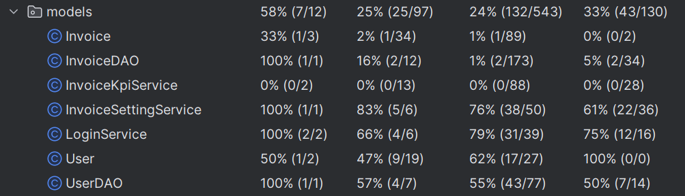

# Einleitung
**Lunchify** ist eine Desktopanwendung zur Verwaltung und Rückerstattung von Essensrechnungen (Restaurant/Supermarkt) in Organisationen.
Sie bietet Funktionen zur Rechnungserfassung, automatischen Auswertung der Belege und einer rollenbasierten Benutzeroberfläche.
Die Änderungen am System sowie eingegebenen und hochgeladenen Daten werden dabei online in einer Datenbank gespeichert.

# Umgesetzte Anforderungen
* Alle Anforderungen wurden umgesetzt.
* Hier gehts zur genauen Auflistung und wer für welche Issues verantwortlich war: 
[Implementierte Anforderungen](https://github.com/jku-win-se/teaching-2025.ss.prse.braeuer.team1/issues?q=is%3Aissue%20state%3Aclosed)
* Dieser Link führt zur Zeitaufzeichnung auf Clockify und zeigt die Verteilung auf die einzelnen Teammitglieder: 
[Zeitaufzeichnung](https://app.clockify.me/reports/summary?start=2025-03-01T00:00:00.000Z&end=2025-06-30T23:59:59.999Z&filterValuesData=%7B%22users%22:%5B%2267cb0c46ee7ecc36b29c0687%22,%2267cae9b62e0f3f5949d8b77d%22,%2267cae93379cfb04fc1c74bda%22%5D,%22userGroups%22:%5B%5D,%22userAndGroup%22:%5B%5D%7D&filterOptions=%7B%22userAndGroup%22:%7B%22status%22:%22ACTIVE_WITH_PENDING%22%7D%7D)
* Hier der Link zur initialen Projektanforderung: 
[Projektanforderung](docs/Anforderungen_Lunchify.pdf)

# Überblick über die Applikation aus Benutzersicht

- [Benutzerdokumentation](docs/LunchifyBenutzerdokumentation.md)

# Überblick über die Applikation aus Entwicklersicht

- [Systemdokumentation](docs/LunchifySystemdokumentation.md)

### Wichtige Design Entscheidungen

Entscheidung: Desktop-App anstatt Web-App
* Begründung: Geringe Erfahrung im Bereich HTML
* Alternativen: Mobile/Android
* Annahmen: Leichtere Umsetzung durch vorhandene Erfahrung
* Konsequenzen: Nur auf Desktops nutzbar

Entscheidung: JavaFX für GUI
* Begründung: Leichtere und moderne Umsetzung mit SceneBuilder
* Alternativen: Java Swing
* Annahmen: Schnell zu erlernendes Tool
* Konsequenzen: Relativ viel Einarbeitungszeit

Entscheidung: Design Pattern Model View Controller
* Begründung: Sinvolle Designentscheidung für GUI-Apps
* Alternativen: Klassen, die Modell und Controller vereinen
* Annahmen: Bessere Veränderlichkeit, Lesbarkeit und Testbarkeit des Codes
* Konsequenzen: Anfangs mit wenig Erfahrung etwas schwierig umzusetzen

## Code Qualität
Hauptsächlich wurden Konsolenausgaben, die für Debbugingzwecke erstellt wurden, gefunden und dann wieder gelöscht.
Andere Errors die behoben wurden, betrafen Naming-Conventions z.B. bei Enums und nicht genutzte Imports sowie ungenützte Variablen.

## Testen
Es wurden JUnit Test für die Klassen InvoiceDAO, InvoiceSettingService, LoginService und UserDAO erstellt.
Andere Klassen sind aufgrund der engen Interaktion mit dem UI schwer per JUnit testbar, dies wurde in der Klassenbeschreibung
im Code angemerkt.
- **InvoiceDAOTest** - Hier wird geprüft, dass die Methoden zum Überprüfen von gültigen Werten, betreffend das Datum und den Rechnungsbetrag,
richtig funktionieren. 
- **InvoiceSettingServiceTest** - Hier werden auch die Methoden zum Überprüfen von gültigen Werten getestet, 
außerdem wird der Datenbankzustand aktiv verändert, ein Soll/Ist vergleich durchgeführt und schlussendlich der vorherige
Datenbankzustand wieder rückgesetzt.
- **LoginServiceTest** - Hier werden alle möglichen User-Zustände (Admin, Aktiv, Inaktiv, User) und auch falsche Eingaben auf die 
richtige Reaktion überprüft.
- **UserDAOTest** - Hier wird beispielsweise überprüft, ob das hinzufügen eines neuen Users mit einer schon verwendeten E-Mail
fehlschlägt. 




# JavaDoc für wichtige Klassen, Interfaces und Methoden
- **LoginController**	Authentifizierung, Menüauswahl
- **UploadController**	Rechnung hochladen + OCR-Analyse
- **InvoiceDAO**	Datenbankzugriff für Rechnungen
- **InvoiceSettingService**	Rückerstattungslogik + Konfiguration
- **BaseController**	Steuert das Hauptlayout & Viewwechsel
- **LunchifyApplication**	Einstiegspunkt (Main-Class)
- *Genauere Beschreibung im Code der Klassen*
---

# Installationsanleitung
1. Stelle sicher, dass **Java Runtime Environment (JRE) 21** oder höher installiert ist.
2. Lade die neueste **Lunchify** `.jar`-Datei herunter.
3. Starte das Programm mit einem Doppelklick.

- Optional kannst du das Programm auch selbst mit Git und Maven (3.6+) builden (für erfahrene Benutzer):
```bash
git clone https://github.com/jku-win-se/teaching-2025.ss.prse.braeuer.team1.git
cd teaching-2025.ss.prse.braeuer.team1
mvn package
```

## Wichtige Hinweise

- **OCR Erkennung** basiert auf **Tesseract**.
  - Für ARM64 Windows heißt das, die OCR funktioniert nicht.
- Rechnungen sollten gut lesbar eingescannt sein.
- Bei Fehlern bitte an das Entwicklerteam wenden.