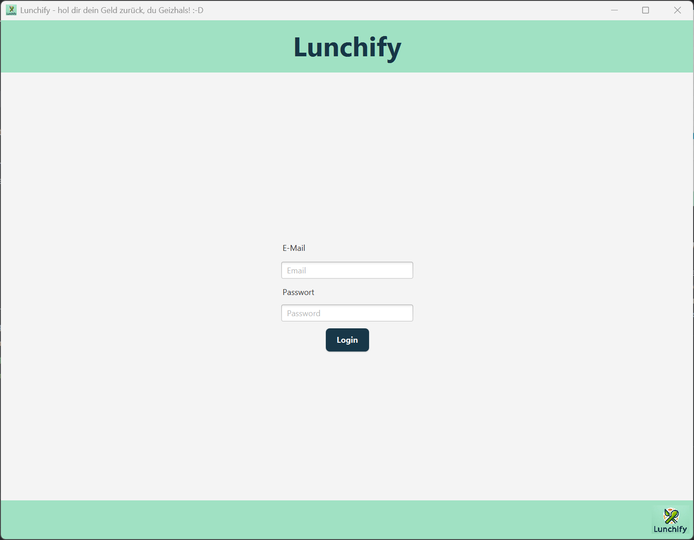
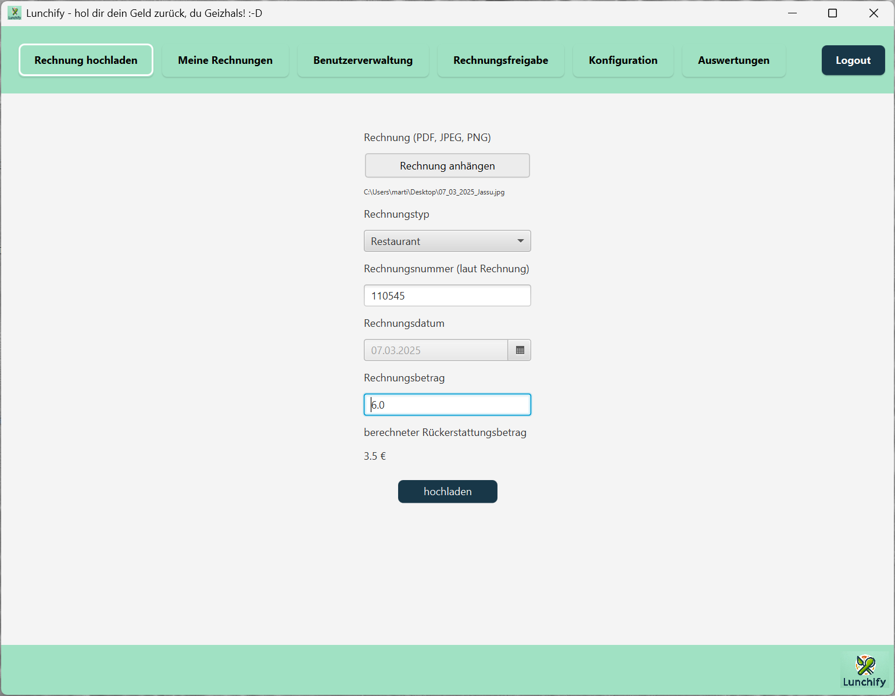
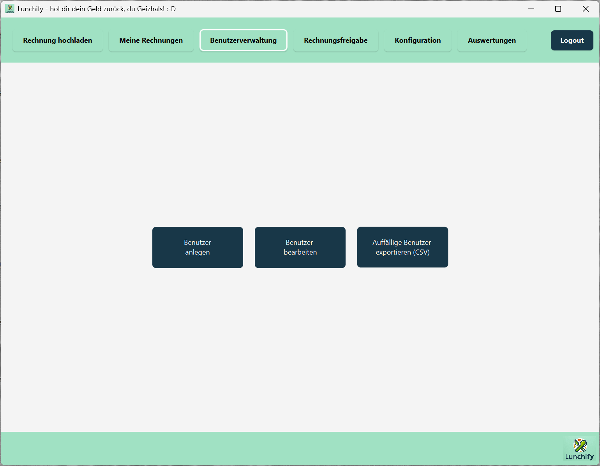
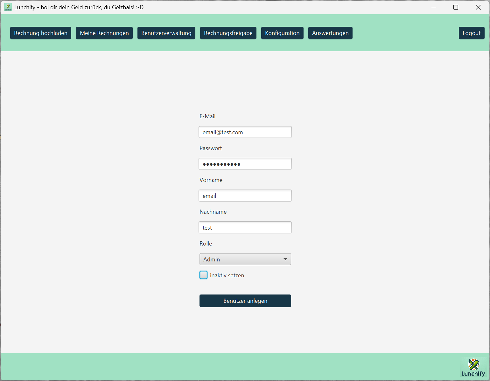
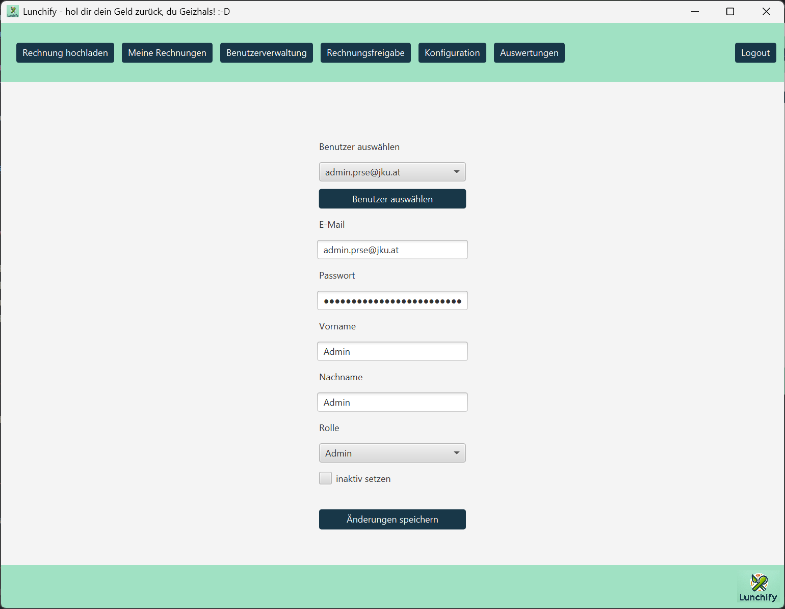
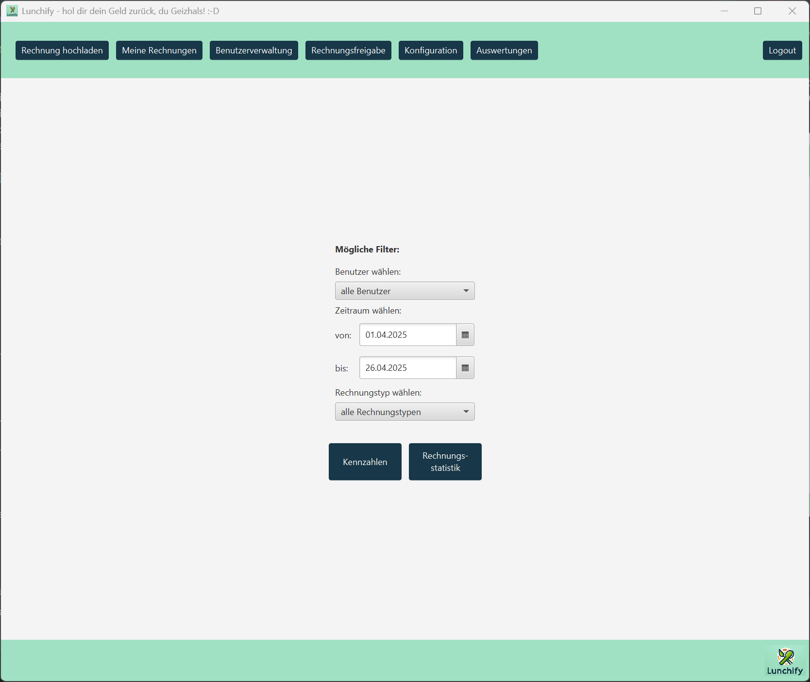
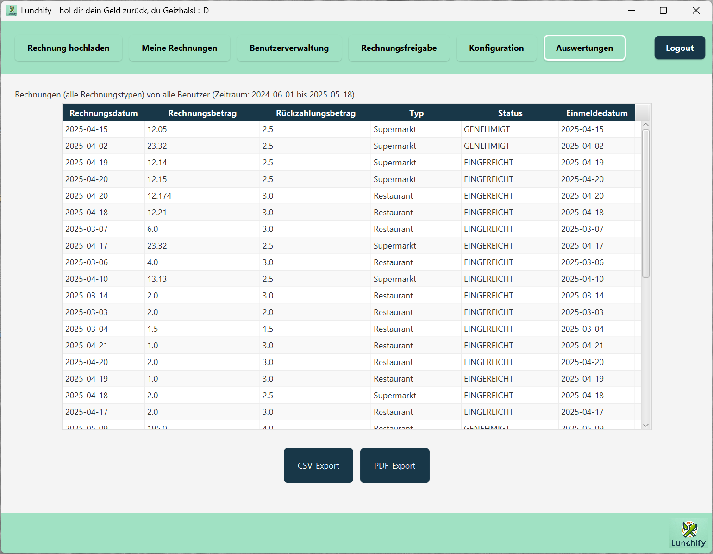

# Lunchify Benutzerdokumentation

Willkommen bei **Lunchify**! Dieses Dokument hilft dir beim Einstieg und erklärt, wie du **Lunchify** nutzen kannst.
**Lunchify** ist eine Desktopanwendung zur Verwaltung und Rückerstattung von Essensrechnungen (Restaurant/Supermarkt) in Organisationen. 
Sie bietet Funktionen zur Rechnungserfassung, automatischen Auswertung der Belege und einer rollenbasierten Benutzeroberfläche. 
Die Änderungen am System sowie eingegebenen und hochgeladenen Daten werden dabei online in einer Datenbank gespeichert.

---

# Lunchify starten

1. Stelle sicher, dass **Java Runtime Environment (JRE) 21** oder höher installiert ist.
2. Lade die neueste **Lunchify** `.jar`-Datei herunter.
3. Starte das Programm mit einem Doppelklick.

- Optional kannst du das Programm auch selbst mit Git und Maven (3.6+) builden (für erfahrene Benutzer):
```bash
git clone https://github.com/jku-win-se/teaching-2025.ss.prse.braeuer.team1.git
cd teaching-2025.ss.prse.braeuer.team1
mvn package
```
---

# Anmeldung

Beim Start von Lunchify erscheint der **Login-Screen**:

- **Benutzername** eingeben
- **Passwort** eingeben
- Auf **Login** klicken

> Falls du kein Konto hast, kontaktiere den Administrator.



---

# Hauptanwendungsfälle und Screens

## Rechnung hochladen

- Sichbar für Admin und User

Nach dem Einloggen kannst du direkt eine Rechnung hochladen.
Klicke dazu zuerst auf Rechnung anhängen und wähle deine Rechnung aus, nach dem Auswählen
wir diese direkt durch die automatische Bilderkennung ausgewertet und die Felder werden gesetzt.
Überprüfe die Daten und korrigiere sie gegebenenfalls.
Bedenkte, dass nur eine Rechnung für jeden Tag hochgeladen werden kann.
Sobald die Daten richtig eingegeben sind, kannst du auf *hochladen* klicken.
Sollte etwas nicht stimmen, gibt dir die Anwendung eine Fehlermeldung.
Wenn alles funktioniert hat, bekommst du eine Erfolgsmeldung.



## Meine Rechnungen

- Sichbar für Admin und User

Hier erhältst du einen Überblick über deine eingereichten Rechnungen, ihren Status und kannst sie bis ans Ende
des Abrechnungsmonats bearbeiten.


## Benutzerverwaltung
- Sichtbar für Admin
####
Hier kann zuerst zwischen **Benutzer anlegen** und **Benutzer bearbeiten** entschieden werden.



### Benutzer anlegen
Gib alle Daten ein, wähle die Rolle (Admin/User) aus und klicke dann auf 
**Benutzer anlegen**. Der Benutzer kann schon bei der Anlage auf inaktiv gesetzt werden, solange dieses Feld nicht
wieder abgewählt wird (Benutzer bearbeiten), kann sich der erstellte Benutzer nicht am System anmelden.
Sollte etwas nicht stimmen, gibt dir die Anwendung eine Fehlermeldung.
Wenn alles funktioniert hat, bekommst du eine Erfolgsmeldung.



### Benutzer bearbeiten
Wähle den zu bearbeitenden Benutzer aus der Liste aus, die Felder werden im Anschluss automatisch gefüllt.
Nimm die gewünschten Änderungen vor und bestätige mit **Änderungen speichern**.
Sollte etwas nicht stimmen, gibt dir die Anwendung eine Fehlermeldung.
Wenn alles funktioniert hat, bekommst du eine Erfolgsmeldung.



## Rechnungsfreigabe
- Sichtbar für Admin

Hier erhältst du einen Überblick über die eingereichten Rechnungen, die vom System als **verdächtig** eingestuft
worden sind und eine manuelle Freigabe benötigen.
Beim Klick auf eine Rechnung öffnet sich das Fenster Rechnungsdetails.
Dort können Änderungen vorgenommen, die Rechnung freigegeben oder abgelehnt und diese auch gelöscht werden.
Der angemeldete Admin kann seine eigenen Rechnungen hier aus Sicherheitsgründen nicht einsehen und bearbeiten.
Sollte etwas nicht stimmen, gibt dir die Anwendung eine Fehlermeldung.
Wenn alles funktioniert hat, bekommst du eine Erfolgsmeldung.


## Konfiguration
- Sichtbar für Admin

Hier können die Rückerstattungsbeträge für das System geändert werden.
Die Änderungen gelten dann nach dem Klick auf **Refundierungsbetrag ändern** für danach hochgeladene Rechnungen.
Sollte etwas nicht stimmen, gibt dir die Anwendung eine Fehlermeldung.
Wenn alles funktioniert hat, bekommst du eine Erfolgsmeldung.


## Auswertungen
- Sichtbar für Admin

Hier können die **Rechnungsstatistik** und **Kennzahlen** zu den ausgewählten Benutzern, Zeiträumen und Rechnungstypen
angefordert werden.



### Rechnungsstatistik
Nach dem Kick auf **Rechnungstatistik** wird hier eine Übersicht angezeigt.
Diese kann als `.csv` und `.pdf` exportiert werden.



### Kennzahlen NOT FINISHED
TO BE MADE


## Wichtige Hinweise

- **OCR Erkennung** basiert auf **Tesseract**.
    - Für ARM64 Windows heißt das, die OCR funktioniert nicht.
- Rechnungen sollten gut lesbar eingescannt sein.
- Bei Fehlern bitte an das Entwicklerteam wenden.

---

# Beenden

Zum Schließen einfach das Fenster schließen oder im Programm abmelden und schließen.

---

# Kontakt

Bei Fragen oder Problemen:

- 📧 E-Mail: support@nichtVorhanden.at
- 🌐 Website: [Lunchify GitHub Repository](https://github.com/jku-win-se/teaching-2025.ss.prse.braeuer.team1)

---

**Viel Spaß mit Lunchify, hol dir dein Geld zurück, du Geizhals! :-D**

