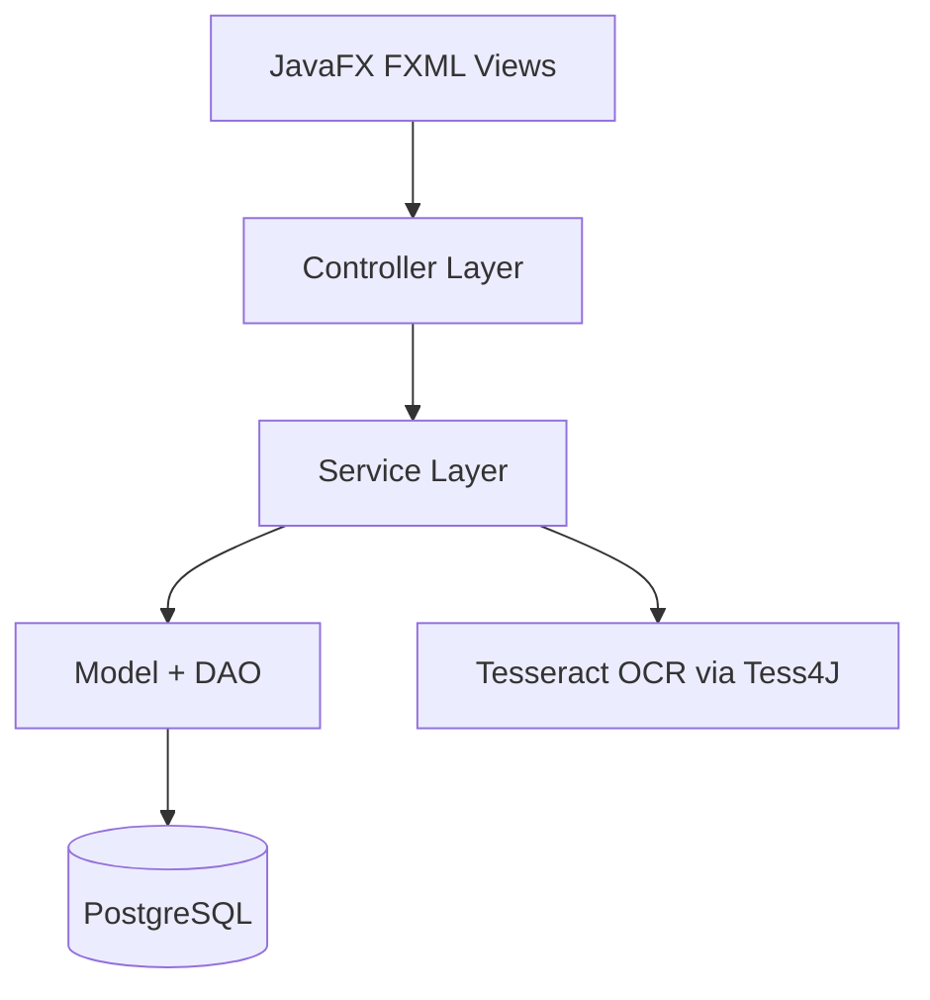

# Lunchify

**Lunchify** ist eine JavaFX-Desktopanwendung zur Verwaltung und Rückerstattung von Essensrechnungen (Restaurant/Supermarkt) in Organisationen. Sie bietet Funktionen zur Rechnungserfassung, automatischen Auswertung via OCR und einer rollenbasierten Benutzeroberfläche. Die Änderungen am System sowie eingegebenen und hochgeladenen Daten werden dabei auf einer PostgreSQL Datenbank persistiert.

---

## Features

- Login mit Benutzerrollen (Admin/User)
- Admins sehen zusätzliche Auswertungen und Menüpunkte (z. B. Einstellungsansicht)
- Upload & automatisierte Analyse von Essensrechnungen
- Tesseract OCR zur Erkennung von Betrag, Restaurant, Rechnungsnummer und Datum
- Rechnungshistorie und Verwaltung
- PostgreSQL-Datenbankanbindung

---

## Schnellstart

### Voraussetzungen
- Java 21
- Maven 3.6 oder höher
- Internetverbindung für Datenbankverbindung

### Build & Start
```bash
git clone https://github.com/jku-win-se/teaching-2025.ss.prse.braeuer.team1.git
cd teaching-2025.ss.prse.braeuer.team1
mvn clean javafx:run
// oder
java -jar target/luchify.jar
```

---

## Technologie-Stack

| Komponente       | Technologie                     |
|------------------|---------------------------------|
| GUI              | JavaFX + FXML                   |
| Build-Tool       | Maven                           |
| Datenbank        | PostgreSQL (über Supabase)      |
| OCR              | Tess4J (Tesseract Wrapper)      |
| Passwort-Hashing | Bcrypt (eigene Serviceklasse)   |
| Testing          | JUnit 5                         |

---


## Projektstruktur

- Das System folgt einem klassischen MVC-ähnlichen Aufbau
```
src/
├── main/
│   ├── java/
│   │   └── at/jku/se/lunchify/
│   │       ├── controller/        → GUI-Controller für FXML-Views
│   │       ├── models/            → Entitäten & Services (z. B. Invoice, User)
│   │       └── security/          → Passwort-Hashing
│   └── resources/
│       ├── fxml/                  → UI-Dateien für die JavaFX-Oberfläche
│       └── tessdata/              → Tesseract-TrainedData für OCR
└── test/java/at/jku/se/lunchify   → Testklassen 
```


---

## Architekturdiagramm



---

## Security & Benutzerrollen

- Passwort-Validierung über eigene `PasswordService` (BCrypt)
- Rollen:
  - **Admin**: Zugriff auf Einstellungen & Auswertungen
  - **User**: Rechnungen hochladen & verwalten

---

## Rechnungsanalyse mit OCR

- Upload als Bild oder PDF
- Rechnungsanalyse per OCR (Tesseract) automatisiert:
  - Betrag
  - Restaurant/Supermarkt-Erkennung
  - Rechnungsnummer
  - Datum
- Prüfung, ob für ein Datum bereits ein Upload existiert
- Speicherung als Invoice in der DB
- Anomalieerkennung bei Änderung von Daten

---

## Entwicklerhinweise

- **Datenbankverbindung**: Zugangsdaten sind aktuell im Code hardcodiert (InvoiceDAO, LoginController etc.)
- **OCR-Problematik auf ARM64** Native .dll funktionieren nicht auf ARM64-Systemen → Alternative CLI oder Trennung von Plattformlogik.
- **Userzustand** LoginController.currentUserId wird statisch gespeichert → Globaler Login-Zustand

### Wichtige Klassen
- **LoginController**	Authentifizierung, Menüauswahl
- **UploadController**	Rechnung hochladen + OCR-Analyse
- **InvoiceDAO**	Datenbankzugriff für Rechnungen
- **InvoiceSettingService**	Rückerstattungslogik + Konfiguration
- **BaseController**	Steuert das Hauptlayout & Viewwechsel
- **LunchifyApplication**	Einstiegspunkt (Main-Class)
---

## Autoren

- **Projekt:** PRSE SoSe 2025 – Gruppe 1, betreut von Johannes Bräuer
- **Mitwirkende:** Kerim Ljutic, Carina Moßbauer, Martin Wallner

---

## Ressourcen

- [JavaFX Dokumentation](https://openjfx.io/)
- [Tess4J GitHub](https://github.com/nguyenq/tess4j)
- [PostgreSQL JDBC](https://jdbc.postgresql.org/)
- [BCrypt-PasswortHashing](https://dev.to/kailashnirmal/understanding-bcrypt-the-secure-way-to-hash-passwords-aj5)